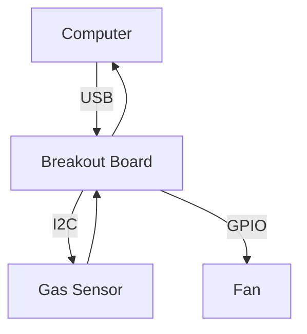
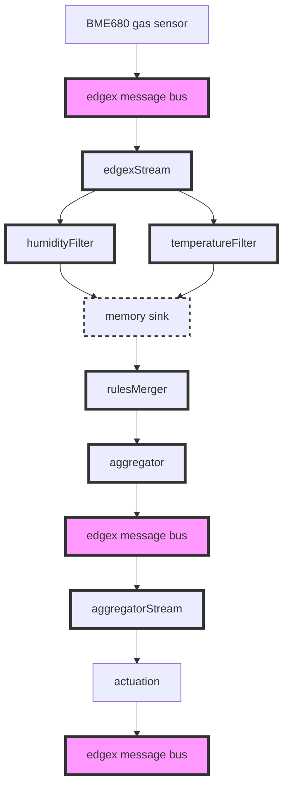

# Climate Control Demo

This is a guide to setup a simple climate control demo with EdgeX and your personal computer.

## Hardware / Software requirements



- AMD64 computer with a USB port - This is where we will run EdgeX
  - Running Ubuntu 22.04
- [Adafruit FT232H](https://www.adafruit.com/product/2264) USB to GPIO, SPI, I2C breakout board
- [BME680](https://learn.pimoroni.com/article/getting-started-with-bme680-breakout) gas sensor
- 3.3v fan or LED for actuation

## Set up the hardware
FT232H pinout: https://learn.adafruit.com/circuitpython-on-any-computer-with-ft232h/pinouts

FT232H setup: https://learn.adafruit.com/circuitpython-on-any-computer-with-ft232h/linux

GPIO: https://learn.adafruit.com/circuitpython-on-any-computer-with-ft232h/gpio

BME680 sensor: https://learn.pimoroni.com/article/getting-started-with-bme680-breakout

BME680 library: https://github.com/adafruit/Adafruit_CircuitPython_BME680

## Run test scripts
Example:
```bash
source env.sh
python test-ft232h-gpio.py
```

## Install EdgeX platform
```
sudo snap install edgexfoundry --edge
```

## Install the device service
Refer to [edgex-device-ft232h-bme680](https://github.com/farshidtz/edgex-device-ft232h-bme680)
## Install and configure rules engine (aka eKuiper)
```
sudo snap install edgex-ekuiper --edge
```
Update configuration file in eKuiper to subscribe to all EdgeX events in EdgeX Message bus:
```
sudo nano /var/snap/edgex-ekuiper/current/etc/sources/edgex.yaml
# change value of `default.topic` from `rules-events` to `edgex/events/#`
# change value of `default.messageType` from `event` to `request`
```


Restart the service to pick up the changes made to the config file:
```
sudo snap restart edgex-ekuiper
```

Please refer to [edgex-ekuiper-snap](https://github.com/canonical/edgex-ekuiper-snap#work-without-app-service-configurable-filtering) for detailed instructions.

## Setup streams and rules pipeline


1. Create stream `edgexStream`:
```
edgex-ekuiper.kuiper-cli create stream edgexStream '() WITH (TYPE="edgex")'
```
2. Create rule `humidityFilter`:
```
edgex-ekuiper.kuiper-cli create rule humidityFilter '
{
 "sql":"SELECT humidity, deviceName FROM edgexStream WHERE humidity > 0 AND humidity < 100",
 "actions": [
     {
       "log":{}
     },
    {
      "memory": {
       "topic": "result/source/humidityFilter"
      }
    }
  ]
}'
```
We send the result of the `humidityFilter` to the memory sink where we can reuse 
the result in multiple successive rules running in parallel.

3. Create rule `temperatureFilter`:
```
edgex-ekuiper.kuiper-cli create rule temperatureFilter '
{
 "sql":"SELECT temperature, deviceName FROM edgexStream WHERE temperature > 0 AND temperature < 100",
 "actions": [
     {
       "log":{}
     },
    {
      "memory": {
       "topic": "result/source/temperatureFilter"
      }
    }
  ]
}'
```
The `temperatureFilter` rule here could be extended into two rules for further analysis.
As an example, the first rule could filter out extreme or unrealistic data, 
and the second rule could convert the temperature from Celsius to Fahrenheit.

4. Create stream `rulesMerger`:
```
edgex-ekuiper.kuiper-cli create stream rulesMerger '() WITH (DATASOURCE="result/source/#",TYPE="memory")'
```
5. Create rule `aggregator`:
```
edgex-ekuiper.kuiper-cli create rule aggregator '
{
  "sql":"SELECT AVG(humidity) AS avgHumidity, AVG(temperature) AS avgTemperature, deviceName FROM rulesMerger GROUP BY meta(deviceName)=\"GasSensor\", HOPPINGWINDOW(ss, 30, 10)",
  "actions": [
    {
      "log":{}
    },  
    {
      "edgex": {
        "connectionSelector": "edgex.redisMsgBus",
        "topicPrefix": "edgex/events/device",
        "messageType": "request",
        "sendSingle": true,
        "deviceName": "aggregator",
        "contentType": "application/json",
        "dataTemplate": "{{if (or (ge .avgHumidity 40.0) (ge .avgTemperature 30.0) ) }} {\"actuation\": true} {{else}} {\"actuation\": false} {{end}}"
      }
    }
  ]
}'
```
The rules pipeline can be extended flexibly.
For example, we could add a memory sink in the `actions` field - as done in steps 2 and 3.
Then, further rules can consume data from the memory sink and perform more analysis.

6. Create stream `aggregatorStream`:
```
edgex-ekuiper.kuiper-cli create stream aggregatorStream '() WITH (DATASOURCE="edgex/events/device/aggregator",TYPE="edgex")'
```
7. Create rule `actuation`:
```
edgex-ekuiper.kuiper-cli create rule actuation '
{
  "sql":"SELECT actuation FROM aggregatorStream WHERE actuation=true OR actuation=false",
  "actions": [
    {
      "log":{}
    }, 
    {
      "rest": {
        "url": "http://localhost:59882/api/v2/device/name/Fan/State",
        "method": "PUT",
        "bodyType": "json",
        "dataTemplate":  "{\"State\":{{.actuation}}}",
        "sendSingle": true
      }
    }, 
    {
      "edgex": {
        "connectionSelector": "edgex.redisMsgBus",
        "topicPrefix": "edgex/events/device",
        "messageType": "request",
        "sendSingle": true,
        "deviceName": "actuation",
        "contentType": "application/json",
        "dataTemplate": "{\"State\":{{.actuation}}}"
      }
    }
  ]
}'
```
Viewing and following logs:
```
snap logs -f edgex-ekuiper
```
