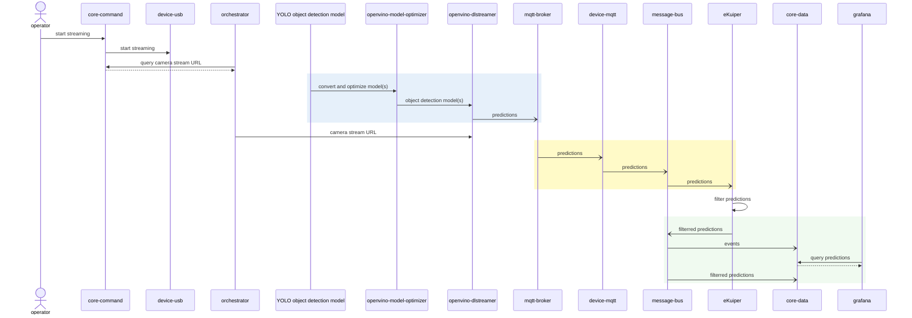

```mermaid
sequenceDiagram
    actor operator

    operator ->> core-command:  start streaming
    %% operator ->> device-usb: refresh devices
    core-command ->> device-usb: start streaming
    orchestrator ->> core-command: query camera stream URL
    core-command -->> orchestrator: 


    rect rgb(230,240,250)
        YOLO object detection model ->> openvino-model-optimizer: convert and optimize model(s)
        openvino-model-optimizer ->> openvino-dlstreamer:  object detection model(s)
        openvino-dlstreamer -) mqtt-broker: predictions
        
    end

    orchestrator ->> openvino-dlstreamer: camera stream URL


    rect rgb(255, 250, 200)
        mqtt-broker -) device-mqtt: predictions
        device-mqtt -) message-bus: predictions 
        message-bus -) eKuiper: predictions
    end
    
    eKuiper ->> eKuiper: filter predictions

    rect rgb(240, 250, 240)
        eKuiper -) message-bus: filterred predictions

        message-bus -) core-data: events
        grafana ->> core-data: query predictions
        core-data -->> grafana: 
    
        message-bus -) core-data: filterred predictions
        %message-bus -) support-scheduler: filterred predictions
    end

    %support-scheduler ->> operator: send alert by email

```