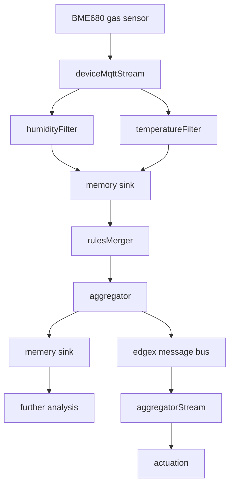

# Temperature Controller Demo

## Set up the hardware
USB to GPIO: https://www.adafruit.com/product/2264
Pinout: https://learn.adafruit.com/circuitpython-on-any-computer-with-ft232h/pinouts

Setup: https://learn.adafruit.com/circuitpython-on-any-computer-with-ft232h/linux

Control GPIO: https://learn.adafruit.com/circuitpython-on-any-computer-with-ft232h/gpio

BME680 sensor: https://learn.pimoroni.com/article/getting-started-with-bme680-breakout
Library: https://github.com/adafruit/Adafruit_CircuitPython_BME680

## Run test scripts
Example:
```bash
source env.sh
python test-ft232h-gpio.py
```

## Run the device service

Install dependencies:
```
sudo snap install edgexfoundry --edge
```

Get a token from edgexfoundry:
```
./add-addon-service.sh
```

Go to `device-service` and configure the devices. Then build and run:
```
go run . --overwrite
```

Get sensor values:
```
curl -X 'GET' 'http://localhost:59882/api/v2/device/name/GasSensor/ReadAll' | jq
```

Set GPIO output:
```
curl -X 'PUT' -d '{"State": true}'  'http://localhost:59882/api/v2/device/name/Fan/State' | jq
curl -X 'PUT' -d '{"State": false}'  'http://localhost:59882/api/v2/device/name/Fan/State' | jq
```

Delete devices and profiles:
```
# Gas sensor
curl -X 'DELETE'   'http://localhost:59881/api/v2/device/name/GasSensor' && curl -X 'DELETE'   'http://localhost:59881/api/v2/deviceprofile/name/BME680'

# GPIO
curl -X 'DELETE'   'http://localhost:59881/api/v2/device/name/Fan' && curl -X 'DELETE'   'http://localhost:59881/api/v2/deviceprofile/name/FanController' 
```
## Install and configure rules engine (aka eKuiper)
```
sudo snap install edgex-ekuiper
```
Update configuration file in eKuiper to subscribe to all EdgeX events in EdgeX Message bus:
```
sudo nano /var/snap/edgex-ekuiper/current/etc/sources/edgex.yaml
# change value of `default.topic` from `rules-events` to `edgex/events/#`
# change value of `default.messageType` from `event` to `request`
```


Restart the service to pick up the changes made to the config file:
```
sudo snap restart edgex-ekuiper
```

Please refer to [edgex-ekuiper-snap](https://github.com/canonical/edgex-ekuiper-snap#work-without-app-service-configurable-filtering) for detailed instructions.

## Setup streams and rules pipeline


Create stream deviceMqttStream:
```
edgex-ekuiper.kuiper-cli create stream deviceMqttStream '() WITH (TYPE="edgex")'
```
Create rule humidityFilter:
```
edgex-ekuiper.kuiper-cli create rule humidityFilter '
{
 "sql":"SELECT humidity, deviceName FROM deviceMqttStream WHERE humidity > 0 AND humidity < 90",
 "actions": [
     {
       "log":{}
     },
    {
      "memory": {
       "topic": "result/source/humidityFilter"
      }
    }
  ]
}'
```
Create rule temperatureFilter:
```
edgex-ekuiper.kuiper-cli create rule temperatureFilter '
{
 "sql":"SELECT temperature, deviceName FROM deviceMqttStream WHERE temperature > 0 AND temperature < 100",
 "actions": [
     {
       "log":{}
     },
    {
      "memory": {
       "topic": "result/source/temperatureFilter"
      }
    }
  ]
}'
```
Create stream rulesMerger:
```
edgex-ekuiper.kuiper-cli create stream rulesMerger '() WITH (DATASOURCE="result/source/#",TYPE="memory")'
```
Create rule aggregator:
```
edgex-ekuiper.kuiper-cli create rule aggregator '
{
  "sql":"SELECT AVG(humidity) AS avgHumidity, AVG(temperature) AS avgTemperature, deviceName FROM rulesMerger GROUP BY meta(deviceName)=\"GasSensor\", HOPPINGWINDOW(ss, 30, 10)",
  "actions": [
    {
      "log":{}
    }, 
    {
      "memory": {
        "topic": "result/source/aggregator"
      }
    }, 
    {
      "edgex": {
        "connectionSelector": "edgex.redisMsgBus",
        "topicPrefix": "edgex/events/device",
        "messageType": "request",
        "sendSingle": true,
        "deviceName": "aggregator",
        "contentType": "application/json",
        "dataTemplate": "{{if (or (le .avgHumidity 80.0) (le .avgTemperature 70.0) ) }} {\"actuation\": true} {{else}} {\"actuation\": false} {{end}}"
      }
    }
  ]
}'
```
Create stream aggregatorStream:
```
edgex-ekuiper.kuiper-cli create stream aggregatorStream '() WITH (DATASOURCE="edgex/events/device/aggregator",TYPE="edgex")'
```
Create rule actuation:
```
edgex-ekuiper.kuiper-cli create rule actuation '
{
  "sql":"SELECT actuation  FROM aggregatorStream",
  "actions": [
    {
      "log":{}
    }, 
    {
      "rest": {
        "url": "http://localhost:59882/api/v2/device/name/Fan/State",
        "method": "PUT",
        "bodyType": "json",
        "dataTemplate":  "{\"State\":{{.actuation}}}",
        "sendSingle": true
      }
    }
  ]
}'
```
Viewing and following logs:
```
snap logs -f edgex-ekuiper
```
