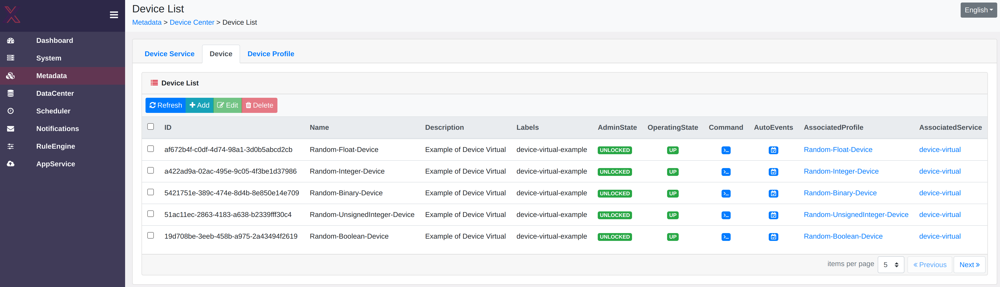
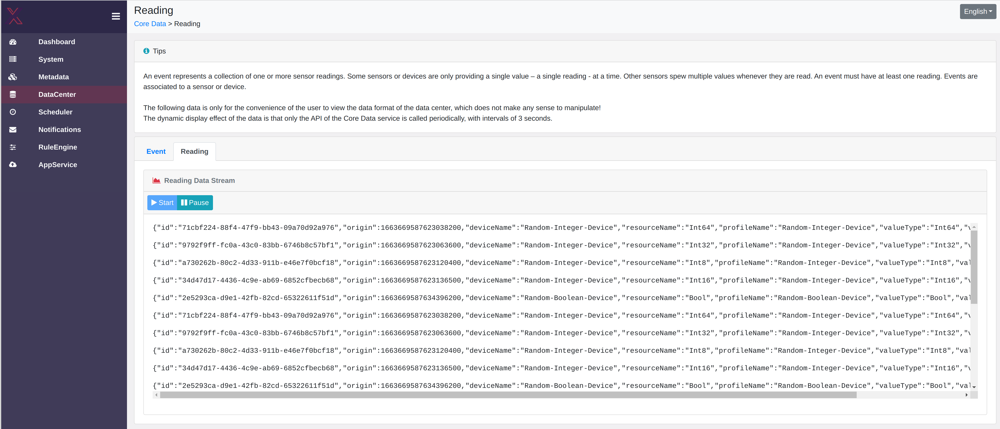

# Ubuntu Core with Virtual EdgeX Device

This is guide for creating an AMD64 [Ubuntu Core](https://ubuntu.com/core) OS image, preloaded with EdgeX core components and the Device Virtual service. Since the image is meant for demonstration purposes only, we will disable the security mechanisms built into EdgeX.

> **Note**  
> This guide has been tested on **Ubuntu 22.04** as the desktop OS. It may work on other Linux distributions and Ubuntu versions. 
>
> Some commands are executed on the desktop computer, but some others on the target Ubuntu Core system. For clarity, we use **🖥 Desktop** and **🚀 Ubuntu Core** titles for code blocks to distinguish where those commands are being executed.

We will use the following tools:

- [snapcraft](https://snapcraft.io/snapcraft) to manage keys in the store and build snaps
- [YQ](https://snapcraft.io/yq) to validate YAML files and convert them to JSON
- [ubuntu-image](https://snapcraft.io/ubuntu-image) to build the Ubuntu Core image
- [EdgeX CLI](https://snapcraft.io/edgex-cli) to query information from EdgeX core components

Install the following:
```bash
# 🖥 Desktop
sudo snap install snapcraft --classic
sudo snap install yq
sudo snap install ubuntu-image --classic
```

## Prepare the Gadget snap

The gadget is available as a prebuilt snap in the store, however, we need to build our own to:
- Extend the size of disk partitions to have sufficient capacity for our EdgeX snaps
- Add default configuration for the EdgeX snaps

To build a Core20 AMD64 gadget, we use the source from [branch `20` of pc-amd64-gadget](https://github.com/snapcore/pc-amd64-gadget/tree/20).

Clone the branch of the repository and enter the newly created directory:
```bash
# 🖥 Desktop
git clone https://github.com/snapcore/pc-amd64-gadget.git --branch=20
cd pc-amd64-gadget
```

Made the following modification in `gadget.yml`:
1. Under `volumes.pc.structure`, find the item with name `ubuntu-seed` and increase its size to `1500M`. This is to make sure our added snaps fit in the partition.
2. Add the following at the top level:
  ```yml
  # Add default config options
  # The child keys are unique snap IDs
  defaults:
    # edgexfoundry
    AZGf0KNnh8aqdkbGATNuRuxnt1GNRKkV:
      # Disable EdgeX security
      # By default, the security components are enabled and external access is only
      # permitted to authenticated users, through the API Gateway.
      security-secret-store: "off"
      # Enable EdgeX 2.2 snap options syntax
      app-options: true
      # Change the bind address of all EdgeX components to listen on all interfaces.
      # By default, this is set to 127.0.0.1 (loopback interface), which make the
      # internal servers to accept local connections only. This change will open
      # external access to unprotected endpoints! This is only for demonstration.
      config.service-serverbindaddr: 0.0.0.0

    # edgex-device-virtual
    AmKuVTOfsN0uEKsyJG34M8CaMfnIqxc0:
      # Automatically start the service
      autostart: true
      # Do not use EdgeX Secret Store
      config.edgex-security-secret-store: false
      # Override the startup message (because we can)
      # The same syntax can be used to override most of the server configurations
      apps.device-virtual.config.service-startupmsg: "Startup message from gadget!"

    # edgex-ui
    9XP2uICRioP5xd6YrpXhP5g4x8XlO5D1:
      # Automatically start the service
      autostart: true
      # Do not use EdgeX Secret Store
      config.edgex-security-secret-store: false
  ```

The gadget source with the above modifications is also available as a submodule in the this repo, under the same directory.

Build, from inside the `pc-amd64-gadget` directory:
```bash
# 🖥 Desktop: pc-amd64-gadget
$ snapcraft --use-lxd
...
Snapped pc_20-0.4_amd64.snap
```

> **Note**  
> You need to rebuild the snap every time you change the `gadget.yaml` file.

### Create an Ubuntu Core model assertion
The model assertion is a document that describes the contents of the OS image. The document needs to be signed by its owner.

Refer to [this article](https://ubuntu.com/core/docs/custom-images#heading--signing) for details on how to sign the model assertion.

Change to the parent directory:
```bash
# 🖥 Desktop: pc-amd64-gadget
cd ..
```

1. Create and register a key if you don't already have one:

```bash
# 🖥 Desktop
snap login
snap keys
# continue if you have no existing keys
# you'll be asked to set a passphrase which is needed before signing
snap create-key edgex-demo
snapcraft register-key edgex-demo
```
We now have a registered key named `edgex-demo` which we'll use later.

2. Create the model assertion

First, make yourself familiar with the Ubuntu Core [model assertion](https://ubuntu.com/core/docs/reference/assertions/model).

Find your developer ID using the Snapcraft CLI:
```bash
# 🖥 Desktop
$ snapcraft whoami
...
id: SZ4OfFv8DVM9om64iYrgojDLgbzI0eiL
```
or from the [Snapcraft Dashboard](https://dashboard.snapcraft.io/dev/account/).

Unlike the official documentation which uses JSON, we use YAML serialization for the model. This is for consistency with all the other serialization formats in this tutorial. Moreover, it allows us to comment out some parts for testing or add comments to describe the details inline.

Create `model.yaml` with the following content:
```yaml
type: model
series: '16'

# authority-id and brand-id must be set to YOUR developer-id
authority-id: SZ4OfFv8DVM9om64iYrgojDLgbzI0eiL
brand-id: SZ4OfFv8DVM9om64iYrgojDLgbzI0eiL

model: ubuntu-core-20-amd64
architecture: amd64

# timestamp should be within your signature's validity period
timestamp: '2022-06-21T10:45:00+00:00'
base: core20

grade: dangerous

snaps:
- # This is our custom, dev gadget snap
  # It has no channel and id, because it isn't in the store.
  # We're going to build it locally and pass it to the image builder. 
  name: pc
  type: gadget
  # default-channel: 20/stable
  # id: UqFziVZDHLSyO3TqSWgNBoAdHbLI4dAH

- name: pc-kernel
  type: kernel
  default-channel: 20/stable
  id: pYVQrBcKmBa0mZ4CCN7ExT6jH8rY1hza

- name: snapd
  type: snapd
  default-channel: latest/stable
  id: PMrrV4ml8uWuEUDBT8dSGnKUYbevVhc4

- name: core20
  type: base
  default-channel: latest/stable
  id: DLqre5XGLbDqg9jPtiAhRRjDuPVa5X1q

- name: core22
  type: base
  default-channel: latest/stable
  id: amcUKQILKXHHTlmSa7NMdnXSx02dNeeT

- name: edgexfoundry
  type: app
  default-channel: latest/stable
  id: AZGf0KNnh8aqdkbGATNuRuxnt1GNRKkV

- name: edgex-device-virtual
  type: app
  default-channel: latest/edge # device virtual snap has not been released as stable
  id: AmKuVTOfsN0uEKsyJG34M8CaMfnIqxc0

- name: edgex-ui
  type: app
  default-channel: latest/edge/pr-553 # dev release to support insecure mode: https://github.com/edgexfoundry/edgex-ui-go/pull/553
  id: 9XP2uICRioP5xd6YrpXhP5g4x8XlO5D1
```

3. Sign the model

We sign the model using the `edgex-demo` key created and registered earlier. 

The `snap sign` command takes JSON as input and produces YAML as output! We use the YQ app to convert our model assertion to JSON before passing it in for signing.

```bash
# 🖥 Desktop
# sign
yq eval model.yaml -o=json | snap sign -k edgex-demo > model.signed.yaml

# check the signed model
cat model.signed.yaml
```

> **Note**  
> You need to repeat the signing every time you change the input model file, because the signature is calculated based on it.

### Build the Ubuntu Core image
We use ubuntu-image and set the following:

- Path to signed model assertion YAML file
- Path to gadget snap that we built in the previous steps

This will download all the needed snaps and build a file called `pc.img`.
Note that even the kernel and OS base (core20) are snap packages!

> **Note**  
> If you plan to use an emulator to install and run Ubuntu Core from the resulting image, it is a good idea to allocate additional writable storage. This necessary if you want to install additional snaps interactively or upgrade existing ones on the emulator.
>
> The default size of the `ubuntu-data` partition is `1G` as defined in the gadget snap. When installing on actual hardware, this partition extends automatically to take the whole remaining space on the disk volume. However, when using QEMU, the partition will have the exact same size because the image size is calculated based on the defined partition structure. The 1GB `ubuntu-data` partition will be 90% full after first boot. You can configure the image to be larger so that the installer expands the partition automatically as with a large disk volume. 
>
> To extend the image size, use the `--image-size` flag in the following command. For example, to add 500MB extra (the original image is around 3.5GB), set `--image-size=4G`.

```bash
$ ubuntu-image snap model.signed.yaml --validation=enforce --snap pc-amd64-gadget/pc_20-0.4_amd64.snap 
Fetching snapd
Fetching pc-kernel
Fetching core20
Fetching core22
Fetching edgexfoundry
Fetching edgex-device-virtual
Fetching edgex-ui
WARNING: "pc" installed from local snaps disconnected from a store cannot be refreshed subsequently!
Copying "pc-amd64-gadget/pc_20-0.4_amd64.snap" (pc)

# check the image file
$ file pc.img
pc.img: DOS/MBR boot sector, extended partition table (last)
```

The warning is because we side-loaded the gadget for demonstration purposes. In production settings, a custom gadget would need to be uploaded to the [store](https://ubuntu.com/internet-of-things/appstore) to also receive updates.

> **Note**  
> You need to repeat the build every time you change and sign the **model** or rebuild the **gadget**.


This image file is ready to be flashed on a medium to create a bootable drive!

### Boot into the OS

You can now flash the image on your disk and boot to start the installation.
However, during development it is best to boot in an emulator to quickly detect and diagnose possible issues.

#### Run in an emulator
Running the image in an emulator makes it easier to quickly try the image and find out possible issues.

We use a `amd64` QEMU emulator. You may refer to [Testing Ubuntu Core with QEMU](https://ubuntu.com/core/docs/testing-with-qemu) and [Image building](https://ubuntu.com/core/docs/image-building#heading--testing) for more information.

Run the following command and wait for the boot to complete:
```bash
# 🖥 Desktop
sudo qemu-system-x86_64 \
 -smp 4 \
 -m 4096 \
 -drive file=/usr/share/OVMF/OVMF_CODE.fd,if=pflash,format=raw,unit=0,readonly=on \
 -drive file=pc.img,cache=none,format=raw,id=disk1,if=none \
 -device virtio-blk-pci,drive=disk1,bootindex=1 \
 -machine accel=kvm \
 -serial mon:stdio \
 -net nic,model=virtio \
 -net user,hostfwd=tcp::8022-:22,hostfwd=tcp::59880-:59880,hostfwd=tcp::4000-:4000
```

The above command forwards the following ports:
- SSH port `22` of the emulator to `8022` on host
- Core Data port `59880` to the same port on host
- EdgeX UI port `4000` to the same port on host

Once the initial installation is complete, you will get a prompt for your email address to create a new user and deploy your public key for SSH access.

> **Note**  
> The `pc.img` file passed to the emulator persists any changes made to the OS and user files after startup.
>
> You can stop and re-start the emulator at a later time without losing your changes.
>
> If you didn't create a backup and need to do a fresh start or flash this on disk, your need to rebuild the image.

> **Warning**  
>> `Could not set up host forwarding rule 'tcp::8443-:8443'`
> 
> This error means that the port is not available on the host. Try stopping the application that uses this port or change the host port (left hand side) to another port number, e.g. `tcp::4001-:4000`.

> **Warning**  
> Bad configuration may lead to strange errors during the first boot.
> In such case, it is best to enable debugging on Ubuntu Core as instructed
[here](https://gist.github.com/farshidtz/12256b08964a5358a4901fe197c11d76). 

### TRY IT OUT
In this step, we connect to the machine that has the image installed over SSH, validate the installation, and interact with some of the EdgeX APIs.

SSH to the Ubuntu Core instance that has our user and public key.

If the instance is emulated as instructed before, the SSH command would be similar to:
```bash
# 🖥 Desktop
ssh <user>@localhost -p 8022
```

If you used the default approach (using `console-conf`) and entered your Ubuntu account email address at the end of the installation, then `<user>` is your Ubuntu account ID. If you don't know your ID, look it up using a browser from [here](https://login.ubuntu.com/) or programmatically from `https://login.ubuntu.com/api/v2/keys/<email>`.

List the installed snaps:
```bash
# 🚀 Ubuntu Core
$ snap list
Name                  Version          Rev    Tracking       Publisher   Notes
core20                20220826         1623   latest/stable  canonical✓  base
core22                20220706         275    latest/stable  canonical✓  base
edgex-device-virtual  2.3.0-dev.16     234    latest/edge    canonical✓  -
edgex-ui              2.3.0-dev.8      691    latest/edge/…  canonical✓  -
edgexfoundry          2.2.0+2          3968   latest/stable  canonical✓  -
pc                    20-0.4           x1     -              -           gadget
pc-kernel             5.4.0-126.142.3  1099   20/stable      canonical✓  kernel
snapd                 2.57.1           16778  latest/stable  canonical✓  snapd
```

Check the status of services:`
```bash
# 🚀 Ubuntu Core
$ snap services
Service                                    Startup   Current   Notes
edgex-device-virtual.device-virtual        enabled   active    -
edgex-ui.edgex-ui                          enabled   active    -
edgexfoundry.app-service-configurable      disabled  inactive  -
edgexfoundry.consul                        enabled   active    -
edgexfoundry.core-command                  enabled   active    -
edgexfoundry.core-data                     enabled   active    -
edgexfoundry.core-metadata                 enabled   active    -
edgexfoundry.device-virtual                disabled  inactive  -
edgexfoundry.kong-daemon                   disabled  inactive  -
edgexfoundry.kuiper                        disabled  inactive  -
edgexfoundry.postgres                      disabled  inactive  -
edgexfoundry.redis                         enabled   active    -
edgexfoundry.security-bootstrapper-redis   disabled  inactive  -
edgexfoundry.security-consul-bootstrapper  disabled  inactive  -
edgexfoundry.security-proxy-setup          disabled  inactive  -
edgexfoundry.security-secretstore-setup    disabled  inactive  -
edgexfoundry.support-notifications         disabled  inactive  -
edgexfoundry.support-scheduler             disabled  inactive  -
edgexfoundry.sys-mgmt-agent                disabled  inactive  -
edgexfoundry.vault                         disabled  inactive  -
```
You can see that the security components, including the API Gateway (`kong-daemon`) have been disabled.

Verify the snap options set via the gadget. For example, query the set snap options of Device Virtual:
```bash
# 🚀 Ubuntu Core
$ snap get edgex-device-virtual -d
{
	"app-options": true,
	"apps": {
		"device-virtual": {
			"config": {
				"service-startupmsg": "Startup message from gadget!"
			}
		}
	},
	"autostart": true,
	"config": {
		"edgex-security-secret-store": false
	}
}
```

Let's install the EdgeX CLI to easily query various APIs:
```bash
# 🚀 Ubuntu Core
$ snap install edgex-cli
edgex-cli 2.2.0 from Canonical✓ installed

# Get the usage manual
$ edgex-cli --help
...

# For example, ping to check the health status of services
$ edgex-cli ping
core-metadata: Fri Sep 16 10:22:44 UTC 2022
core-data: Fri Sep 16 10:22:44 UTC 2022
core-command: Fri Sep 16 10:22:44 UTC 2022
```

This verified that the core services are alive.

Let's now query the devices:
```bash
# 🚀 Ubuntu Core
$ edgex-cli device list
Name                           Description                ServiceName     ProfileName                    Labels                    AutoEvents
Random-UnsignedInteger-Device  Example of Device Virtual  device-virtual  Random-UnsignedInteger-Device  [device-virtual-example]  [{20s false Uint8} {20s false Uint16} {20s false Uint32} {20s false Uint64}]
Random-Float-Device            Example of Device Virtual  device-virtual  Random-Float-Device            [device-virtual-example]  [{30s false Float32} {30s false Float64}]
Random-Integer-Device          Example of Device Virtual  device-virtual  Random-Integer-Device          [device-virtual-example]  [{15s false Int8} {15s false Int16} {15s false Int32} {15s false Int64}]
Random-Binary-Device           Example of Device Virtual  device-virtual  Random-Binary-Device           [device-virtual-example]  []
Random-Boolean-Device          Example of Device Virtual  device-virtual  Random-Boolean-Device          [device-virtual-example]  [{10s false Bool}]
```

The data is being published to the message bus and Core Data will be storing it. We can query to find out:

```bash
# 🚀 Ubuntu Core
$ edgex-cli reading list --limit=2
Origin               Device                         ProfileName                    Value                 ValueType
11 Aug 22 10:50 UTC  Random-UnsignedInteger-Device  Random-UnsignedInteger-Device  14610331353796717782  Uint64
11 Aug 22 10:50 UTC  Random-UnsignedInteger-Device  Random-UnsignedInteger-Device  62286                 Uint16
```


If there is no data, look for errors in the device service logs:
```bash
# 🚀 Ubuntu Core
snap logs -f edgex-device-virtual
```

From the logs, we can't see if the service is actually producing data. We can increase the logging verbosity by modifying the service log level:

```bash
# 🚀 Ubuntu Core
$ snap set edgex-device-virtual config.writable-loglevel=DEBUG
$ snap restart edgex-device-virtual 
Restarted.
$ snap logs -f edgex-device-virtual
2022-09-16T10:26:22Z edgex-device-virtual.device-virtual[5419]: level=DEBUG ts=2022-09-16T10:26:22.703556218Z app=device-virtual source=executor.go:52 msg="AutoEvent - reading Bool"
2022-09-16T10:26:22Z edgex-device-virtual.device-virtual[5419]: level=DEBUG ts=2022-09-16T10:26:22.703576283Z app=device-virtual source=command.go:127 msg="Application - readDeviceResource: reading deviceResource: Bool; X-Correlation-ID: "
2022-09-16T10:26:22Z edgex-device-virtual.device-virtual[5419]: level=DEBUG ts=2022-09-16T10:26:22.703792632Z app=device-virtual source=utils.go:80 msg="Event(profileName: Random-Boolean-Device, deviceName: Random-Boolean-Device, sourceName: Bool, id: a0ccb7cf-0dc6-4ae4-a6b5-a1f165471034) published to MessageBus"
...
```


Congratulations! You now have a running EdgeX platform with dummy devices, producing synthetic readings. We can access this data on the localhost. We can also access the data from other machines because we configured the servers to bind to all interfaces.

In production setting, you would keep the bind address to the loopback interface and only allow authenticated access to endpoints via the API Gateway. For instructions on creating an image with access control in place, refer to the EdgeX example on [**PR:** Creating an EdgeX OS Image](https://github.com/edgexfoundry/edgex-docs/pull/836).

Let's exit the SSH session:
```bash
# 🚀 Ubuntu Core
$ exit
logout
Connection to localhost closed.
```

... and query data from outside:
```bash
# 🖥 Desktop
curl --silent --show-err http://localhost:59880/api/v2/reading/all?limit=2 | jq
```
Replace `localhost` with the device IP address when querying from an actual device, rather than the local emulator.

The above is the Core Data endpoint for querying all readings. 
Refer to [API Reference](https://docs.edgexfoundry.org/2.3/api/Ch-APIIntroduction/) for other endpoints and documentation.
Keep in mind that for the emulation, the command only exposes the Core Data port `59880`. If desired, other ports can be exposed.

Response:
```json
{
  "apiVersion": "v2",
  "statusCode": 200,
  "totalCount": 7040,
  "readings": [
    {
      "id": "5907adb3-18f6-4cf9-9826-216285b7f519",
      "origin": 1660225195484643300,
      "deviceName": "Random-Integer-Device",
      "resourceName": "Int32",
      "profileName": "Random-Integer-Device",
      "valueType": "Int32",
      "value": "445276022"
    },
    {
      "id": "86c87583-a220-44d9-b29a-e412efa97cc3",
      "origin": 1660225195423943200,
      "deviceName": "Random-Integer-Device",
      "resourceName": "Int64",
      "profileName": "Random-Integer-Device",
      "valueType": "Int64",
      "value": "-6696458089943342374"
    }
  ]
}
```

Now, use a web browser and access the EdgeX UI at http://localhost:4000  
As before, replace `localhost` with the device IP address when querying from an another device.




#### Flash the image on disk
Compress an original copy of `pc.img` file to speedup the transfer on disk. If you have used this to install in QEMU, you need to rebuild a new copy.

```bash
# 🖥 Desktop
$ xz -vk -0 pc.img
pc.img (1/1)
  100 %     817.2 MiB / 3,309.0 MiB = 0.247    10 MiB/s       5:30             

$ ls -lh pc.*
-rw-rw-r-- 1 ubuntu ubuntu 3.3G Sep 16 17:03 pc.img
-rw-rw-r-- 1 ubuntu ubuntu 818M Sep 16 17:03 pc.img.xz
```

For device-specific installation instructions, refer to Ubuntu Core section [here](https://ubuntu.com/download/iot). 

For Intel NUC, follow the instructions [here](https://ubuntu.com/download/intel-nuc), but use our locally built image instead of downloading the reference Ubuntu Core image. You'll need to copy the image we just compressed (`pc.img.xz`) to the second USB flash drive.

Once the boot is complete, it will prompt for the email address of your [Ubuntu SSO account](https://login.ubuntu.com/) to create a user and deploy your [SSH public keys](https://login.ubuntu.com/ssh-keys). This is done with the help of a program called `console-conf`. Read [here](https://ubuntu.com/core/docs/system-user) to know how this manual step looks like and how it can be automated.

You may now repeat the instructions given in the [TRY IT OUT](#try-it-out) section, but on the actual device!


## References
- [Getting Started using Snaps](https://docs.edgexfoundry.org/2.3/getting-started/Ch-GettingStartedSnapUsers)
- [EdgeX Core Data](https://docs.edgexfoundry.org/2.3/microservices/core/data/Ch-CoreData/)
- [Ubuntu Core](https://ubuntu.com/core)
- [Gadget snaps](https://snapcraft.io/docs/gadget-snap)
- [Testing Ubuntu Core with QEMU](https://ubuntu.com/core/docs/testing-with-qemu)
- [Ubuntu Core - Image building](https://ubuntu.com/core/docs/image-building#heading--testing)
- [Ubuntu Core - Custom images](https://ubuntu.com/core/docs/custom-images)
- [Ubuntu Core - Building a gadget snap](https://ubuntu.com/core/docs/gadget-building)
